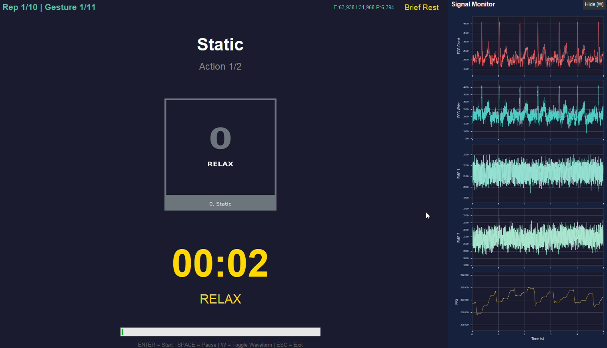
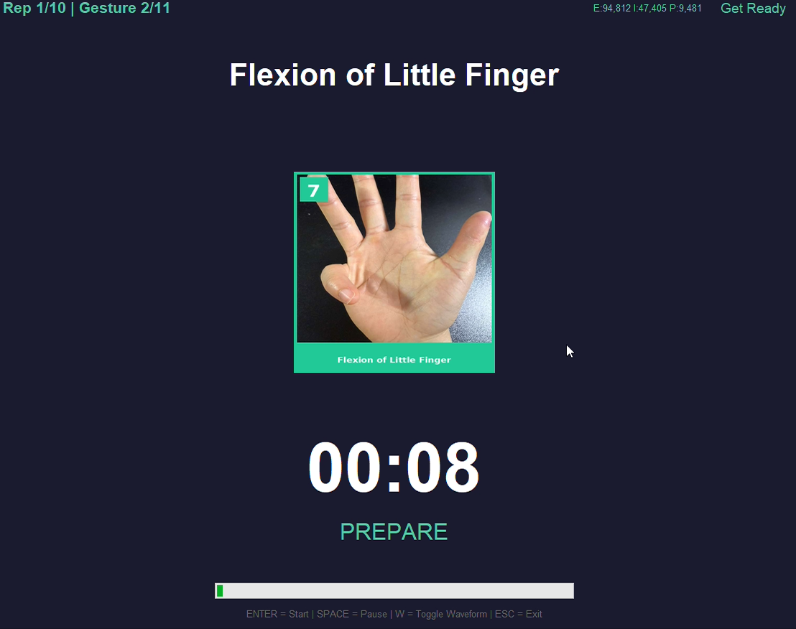
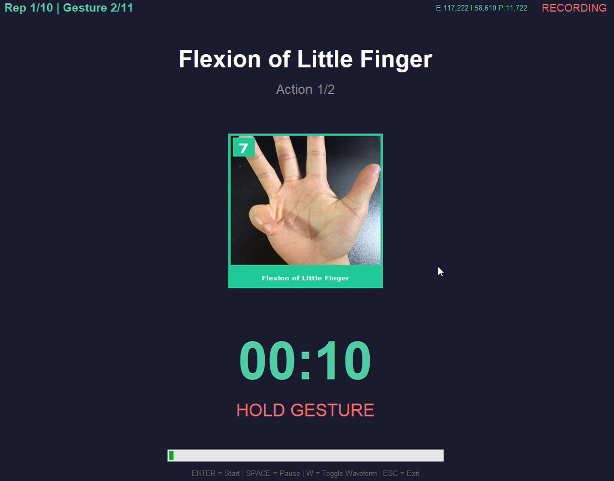
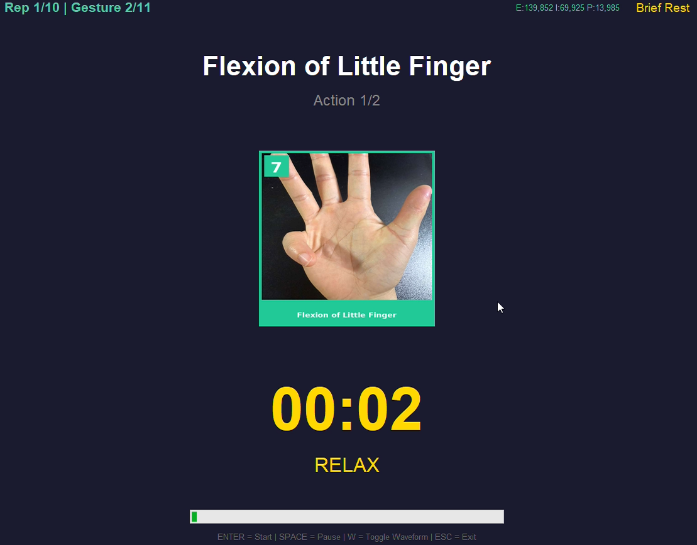

# Stimulus Presentation Program

This is the custom stimulus program for multimodal biosignal data collection. The program displays gesture images and guides participants through the recording session while synchronizing event markers with the data acquisition system.

## Experimental Protocol

### Gesture Set (10 Classes)

| ID | Gesture | Description |
|----|---------|-------------|
| 1 | Hand Close (Fist) | Close all fingers into fist |
| 2 | Hand Open | Extend all fingers fully |
| 3 | Wrist Flexion | Bend wrist downward |
| 4 | Wrist Extension | Bend wrist upward |
| 5 | Index Finger Point | Extend index finger only |
| 6 | Cut Something | Index + middle finger extension |
| 7 | Flexion of Little Finger | Flex little finger only |
| 8 | Tripod Grasp | Thumb + index + middle pinch |
| 9 | Thumb Flexion | Flex thumb toward palm |
| 10 | Flexion of Middle Finger | Flex middle finger only |

Gesture selection is partially aligned with the [Ninapro](http://ninapro.hevs.ch/) dataset.

### Trial Structure

Each gesture is performed **twice** per trial, with a brief relaxation in between:

```
Prepare (10s) → Hold Gesture (~13s) → Brief Rest (3s) → Hold Gesture (~13s)
```

Total per trial: ~40 seconds

The static gesture (ID=0) is always the **first gesture** of each repetition, followed by the 10 dynamic gestures in randomized order.

The stimulus program guides the participant through four phases per trial:

#### 1. Static Gesture (first trial of each repetition)


#### 2. Prepare
Next gesture image appears on screen with a countdown. Participant gets ready.



#### 3. Hold Gesture
Participant performs and holds the displayed gesture (Action 1/2).



#### 4. Brief Rest
Short relaxation between the two actions of the same gesture. After this, the participant performs the same gesture a second time (Action 2/2).



A real-time signal monitor can be toggled at any time by pressing `W`, useful for checking signal quality during the session.

### Repetition Structure

One repetition = all 10 gestures + 1 static in **randomized order** (~7.5 min):

```
Rest 10s → [Gesture ?] ~30s → Rest 10s → [Gesture ?] ~30s → ... × 11 gestures
```

### Full Session

10 repetitions with 30s rest breaks between each (~80 min total recording):

```
Rep 1 → Rest 30s → Rep 2 → Rest 30s → ... → Rep 10
```

| Parameter | Value |
|-----------|-------|
| Total gestures | 10 + 1 static |
| Repetitions | 10 |
| Total trials | 110 |
| Actions per trial | 2 (same gesture performed twice) |
| Rest between gestures | 10 seconds |
| Rest between repetitions | 30 seconds |
| Total recording time | ~80 minutes |

### Features

- Full-screen gesture image display with countdown timer
- Gesture order randomized per repetition
- Audio cues (beep) at action start/end
- Event markers sent to acquisition system for synchronization
- Progress display (current repetition and gesture count)
- Real-time signal monitor (toggle with `W` key)
- Keyboard controls: `ENTER` = Start, `SPACE` = Pause, `W` = Toggle Waveform, `ESC` = Exit

## Usage

```bash
python stimulus.py
```

On launch, enter the Subject ID and Serial Port, then press `ENTER` to begin DAQ monitoring. Press `ENTER` again to start recording.

## Output Structure

Each session creates a folder organized as follows:

```
recordings/
  {SubjectID}_{Timestamp}/
    repetitions/          # .npz sensor data per repetition
      rep_01_data.npz
      rep_02_data.npz
      ...
    events/               # .json event logs per repetition
      rep_01_events.json
      rep_02_events.json
      ...
    session_info.json     # Overall session metadata
```

### Sensor Data (`.npz`)

| Array | Shape | Description |
|-------|-------|-------------|
| `exg` | (N, 4) | [ecg_chest, ecg_wrist, emg1, emg2] @ 2000 Hz |
| `imu` | (K, 6) | [acc_x, acc_y, acc_z, gyr_x, gyr_y, gyr_z] @ 1000 Hz |
| `ppg` | (M, 6) | [hr, spo2, confidence, status, ir, red] @ 200 Hz |

### Event Log (`.json`)

Each event records a timestamp, elapsed time, and the current sample indices (`exg_idx`, `imu_idx`, `ppg_idx`) at the moment the event occurred. This allows precise alignment between events and sensor data during offline analysis.

Event types include:

- `REPETITION_START` / `REPETITION_END`
- `GESTURE_START` / `GESTURE_END`
- `REST_START` — preparation phase before each gesture
- `ACTION_START` / `ACTION_END` — each of the 2 actions per gesture
- `RELAX_START` / `RELAX_END` — brief rest between the two actions
- `GESTURE_ORDER` — randomized gesture sequence for the repetition
- `PAUSED` / `RESUMED` / `CANCELLED`

## Configuration

Key parameters in `CONFIG`:

| Parameter | Default | Description |
|-----------|---------|-------------|
| `rest_duration` | 10s | Preparation time before each gesture |
| `action_duration` | 13s | Duration of each action |
| `relax_between_actions` | 3s | Rest between the two actions |
| `actions_per_gesture` | 2 | Number of times each gesture is performed |
| `repetition_rest` | 30s | Rest between repetitions |
| `num_repetitions` | 10 | Total repetitions per session |

## Dependencies

- Python 3.8+
- `tkinter` (included with Python on Windows)
- `Pillow` — gesture image display
- `numpy` — data storage
- `pyserial` — serial communication with hardware
- `matplotlib` — real-time signal monitor
